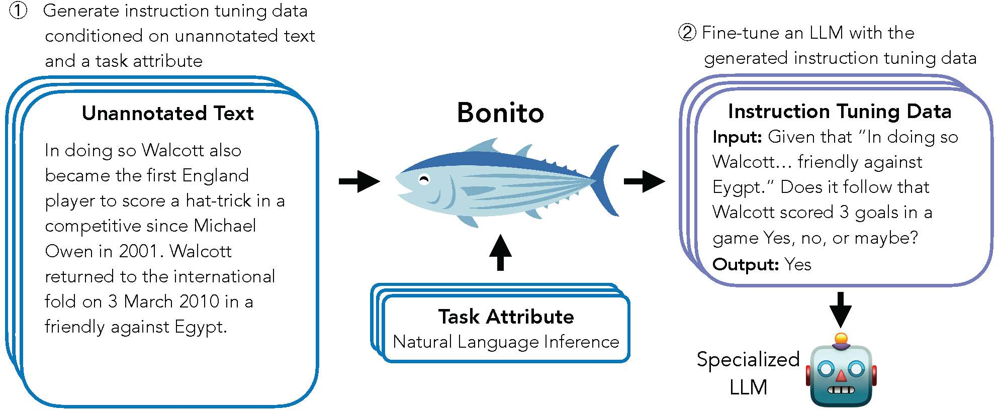

# Bonito

Bonito is an open-source model for conditional task generation: the task of converting unannotated text into task-specific training datasets for instruction tuning. This package is a lightweight wrapper for Bonito to easily create synthetic datasets for instruction tuning built on top of the Hugging Face `transformers` and `vllm` libraries.

- Paper:
- Model: [bonito-v1](https://huggingface.co/BatsResearch/bonito-v1)
- Dataset: [ctga-v1](https://huggingface.co/datasets/BatsResearch/ctga-v1)
- Code: To reproduce experiments in our paper, see [nayak-arxiv24-code](https://github.com/BatsResearch/nayak-arxiv24-code).



## Installation
Create an environment and install the package using the following commands:
```bash
conda create -n bonito python=3.9
conda activate bonito
pip install -e .
```

## Basic Usage
To generate synthetic instruction tuning dataset using Bonito, you can use the following code:
```python
from bonito import Bonito, SamplingParams
from datasets import load_dataset

# Initialize the Bonito model
bonito = Bonito()

# load dataaset with unannotated text
unannotated_text = load_dataset(
    "BatsResearch/bonito-experiment",
    "unannotated_contract_nli"
)["train"].select(range(10))

# Generate synthetic instruction tuning dataset
sampling_params = SamplingParams(max_tokens=256, top_p=0.95, temperature=0.5, n=1)
synthetic_dataset = bonito.generate_tasks(
    unannotated_text,
    context_col="input",
    task_type="nli",
    sampling_params=sampling_params
)
```

<!-- ## Citation
If you use Bonito in your research, please cite the following paper:
```

``` -->
