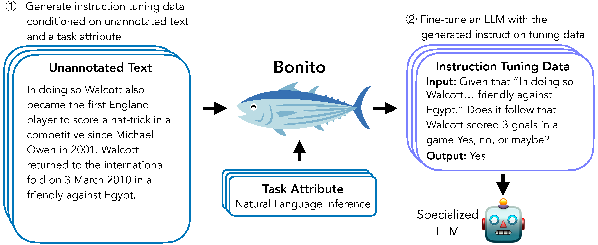

# Bonito

Bonito is an open-source model for conditional task generation: the task of converting unannotated text into task-specific training datasets for instruction tuning. This repo is a lightweight library for Bonito to easily create synthetic datasets built on top of the Hugging Face `transformers` and `vllm` libraries.

- Paper: [Learning to Generate Instruction Tuning Datasets for
Zero-Shot Task Adaptation](https://arxiv.org/abs/2402.18334)
- Model: [bonito-v1](https://huggingface.co/BatsResearch/bonito-v1)
- Demo: [Bonito on Spaces](https://huggingface.co/spaces/nihalnayak/bonito)
- Dataset: [ctga-v1](https://huggingface.co/datasets/BatsResearch/ctga-v1)
- Code: To reproduce experiments in our paper, see [nayak-aclfindings24-code](https://github.com/BatsResearch/nayak-aclfindings24-code).



## News
- 🐡 August 2024: Released [new Bonito model](https://huggingface.co/BatsResearch/Llama-3.1-8B-bonito-v1) with Meta Llama 3.1 as the base model.
- 🐟 June 2024: Bonito is accepted to ACL Findings 2024.

## Installation
Create an environment and install the package using the following commands:
```bash
pip3 install bonito-llm
```

## Basic Usage
To generate synthetic instruction tuning dataset using Bonito, you can use the following code:
```python
from bonito import Bonito
from vllm import SamplingParams
from datasets import load_dataset

# Initialize the Bonito model
bonito = Bonito("BatsResearch/bonito-v1")

# load dataset with unannotated text
unannotated_text = load_dataset(
    "BatsResearch/bonito-experiment",
    "unannotated_contract_nli"
)["train"].select(range(10))

# Generate synthetic instruction tuning dataset
sampling_params = SamplingParams(max_tokens=256, top_p=0.95, temperature=0.5, n=1)
synthetic_dataset = bonito.generate_tasks(
    unannotated_text,
    context_col="input",
    task_type="nli",
    sampling_params=sampling_params
)
```

## Supported Task Types
Here we include the supported task types [full name (short form)]: `extractive question answering` (`exqa`), `multiple-choice question answering` (`mcqa`), `question generation` (`qg`), `question answering without choices` (`qa`), `yes-no question answering` (`ynqa`), `coreference resolution` (`coref`), `paraphrase generation` (`paraphrase`), `paraphrase identification` (`paraphrase_id`), `sentence completion` (`sent_comp`), `sentiment` (`sentiment`), `summarization` (`summarization`), `text generation` (`text_gen`), `topic classification` (`topic_class`), `word sense disambiguation` (`wsd`), `textual entailment` (`te`), `natural language inference` (`nli`)

You can use either the full name or the short form to specify the `task_type` in `generate_tasks`.

## Tutorial
We have created a tutorial [here](https://colab.research.google.com/drive/12OCh4OYo1vr9ZvwIWK4JwZT7rkMrYrx2?usp=sharing) for how to use a quantized version of the model in a Google Colab T4 instance. The quantized version was graciously contributed by user [alexandreteles](https://github.com/alexandreteles).
We have an additional tutorial to try out the Bonito model on A100 GPU on Google Colab [here](https://colab.research.google.com/drive/1XuDRVKpUUqdjrqg2-P2FIqkdAQBnqoNL?usp=sharing).


## Citation
If you use Bonito in your research, please cite the following paper:
```
@inproceedings{bonito:aclfindings24,
  title = {Learning to Generate Instruction Tuning Datasets for Zero-Shot Task Adaptation},
  author = {Nayak, Nihal V. and Nan, Yiyang and Trost, Avi and Bach, Stephen H.},
  booktitle = {Findings of the Association for Computational Linguistics: ACL 2024},
  year = {2024}}
```
